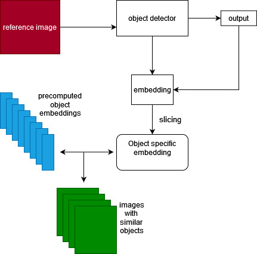
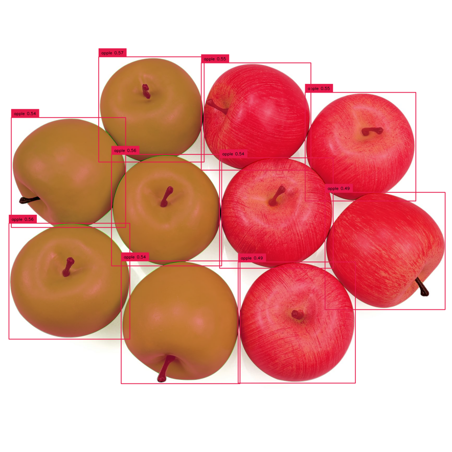
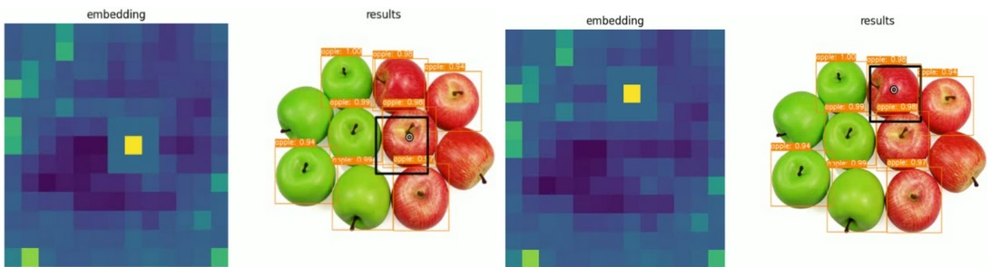
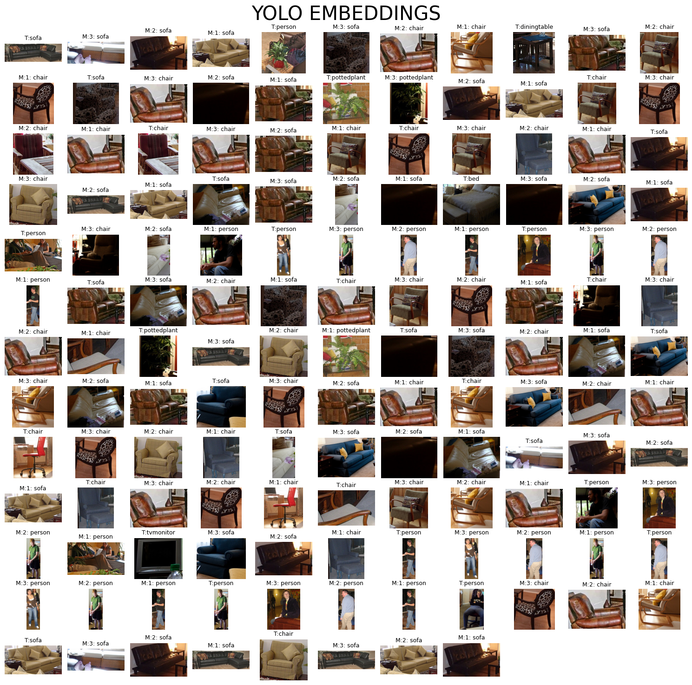

# Neural Network based similar object finder

## the idea

Neural networks are not simply black boxes that solve a single task. A deeper understanding of them will lead to a realization that they are hierarchial information extractors/compressors.

For a more intuitive understanding, consider that we have a dog/cat classifier. Let's say you are looking to adopt a dog, and you want a small, not very furry dog. What if I say a simple neural network classifier can recommend which dogs are to your taste, given a single sample!

A classifier is capable of doing this because, in addition to answering whether an object is simply a dog/cat, it actually learns different features of the object, and the presence of relevant features which collectively inform a prediction.

**given an example containing desired features (small / less furry / colour of your choice) we can find other images/objects(dogs/cats) from a database of images that have these features, hence finding other dogs/cats with features of your liking**

This idea is called *Content based image retrieval*, and this project takes this idea further by using an object detector instead of a classifier. This implies that given an image cluttered with different objects, you can say **show me other images that have couches like the one in this image**

## Applications

Some situations where this workflow can be applied:

1. Searching a furniture catalogue for furniture of similar features/theme/aesthetics.

2. Grouping products by aesthetic or visual similarities.

Automating these kind of abstract and subjective tasks can be vital as it creates a sophisticated user experience.

## The workflow : 


<center>

</center><br>

given an image with many objects and a chosen object, the object finder network finds other images with objects similar to the chosen object by going through the following steps :

1. getting the locations of the different objects in the image from a simple forward pass of the image through the object detection network.

<center>

</center>

2. Getting all the extracted features (refered to as embedding in the flowchart) from the object detection network.

3. using the object locations obtained before to "slice" the relevant parts of the extracted features that is specific to the chosen object

(in the below visualization, the 3x3 cell grid around the yellow grid represents the slice of the "embedding" corresponding tho the area enclosed withing the black square on the right.)

<center>

</center>

4. Using the extracted chosen obeject's features (object-specicific embedding), a similarity search (K nearest neighbours algorithm) is done against a set of pre-computed object-features from a dataset.

5. Finally, the object features that are most similar to those of the chosen object are found and the corresponding images are given as the output.

Below, you can see an extensive experiment, where different targets and their corresponding matches are visualized. each target image starts with the initial **T** , and followed by matches (with title **M**) ordered by decreasing similarity.


<center>

</center>

## Findings:

From the above experiment, we observe that many object feautures like colour, texture, and even its appearance under the lighting in that particular image are extracted and can be leveraged for a variety of tasks, like similarity searches, and recommendations.
___
<br>
<br>

# Code specific instructions:

## OS and ide:

- Windows 11 with Docker for development
- docker desktop version : v4.22.1
- docker version : 24.0.5
- Container is run on WSL2 with ubuntu 22.04

## instructions for exectuing runnables

Using the following environment variables, the below commands (mentioned defining the varibales) can be run in the terminal to create and run the executables.

- Compiler : ```Python 3.7```

## commands for executing the code

### run/ go through the notebooks in the following

1. init_setup.ipynb
2. Resnet_embedding_collector.ipynb
3. embedding_KNN_analyzer.ipynb
4. Yolo_embedding_collector.ipynb
5. embedding_KNN_analyzer.ipynb
6. Location_information_analysis.ipynb